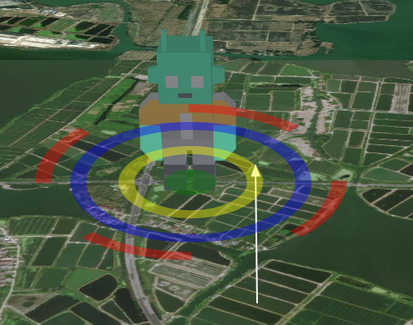
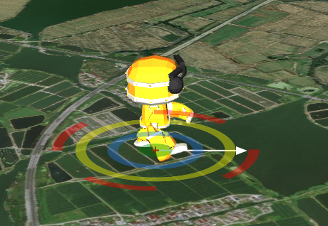

# maptalks.modelcontrol

maptalks model control .
## support geometry:
- GLTFMarker  
  
- ThreeLayer toModel (Model)  


## Install

### NPM


```sh
npm i maptalks.modelcontrol

```

### CDN

```html
 <script type="text/javascript" src="https://unpkg.com/maptalks.modelcontrol/dist/maptalks.modelcontrol.js"></script>
```

## DEMO

- [maptalks.three Model](https://deyihu.github.io/maptalks.modelcontrol/test/threelayer.html)
- [maptalks GLTFMarker](https://deyihu.github.io/maptalks.modelcontrol/test/gltflayer.html)

## API

### `ModelControl` class

```js
import {
    ModelControl
} from 'maptalks.modelcontrol';

const modelcontrol = new ModelControl(map, {
    lineSymbol: {
        lineColor: '#fff'
    },
    scaleColor: 'red',
    rotateColor: 'blue',
    translateColor: 'green',
    highLightColor: 'yellow',
    opacity: 0.4,
    panelSize: 300
});
//set selected model,model is GLTFMarker or maptalks.three BaseObject
modelcontrol.setModel(baseObjectModel);
//enable
modelcontrol.enable();
//disable
modelcontrol.disable();
```

### methods
- `enable()`

- `disable()`

- `setModel(model)`  set current model 


- `setTarget(model)` set current model ,Equivalent to `setModel`

- `setOriginalScale(scale)` set modeo Initialized scaling factor 

```js
    //for GLTFMarker
    modelcontrol.setOriginalScale(gltfMarker.getScale()[0]);
    //for maptalks.three
    modelcontrol.setOriginalScale(baseObjectModel.getObject3d().scale.x);

```


### events

- `translate` when model translate
- `translate_in` when mouse enter translate dom component
- `translate_out`  when mouse leave translate dom component

- `scale` when model scale
- `scale_in` when mouse enter scale dom component
- `scale_out` when mouse leave scale dom component

- `rotation` when model rotation
- `rotation_in`  when mouse enter rotation dom component
- `rotation_out` when mouse leave rotation dom component

- `heihgt` when model heihgt change
- `height_in` when mouse enter heihgt dom component
- `height_out` when mouse leave heihgt dom component

```js
//show tip ,you can do other things
  function showTip(e) {
            const { coordinate, type } = e;
            if (!coordinate) {
                marker.remove();
                return;
            }
            let message = '';
            if (type === 'translate_in') {
                message = '平移';
            } else if (type === 'scale_in') {
                message = '缩放';
            } else if (type === 'rotation_in') {
                message = '旋转';
            } else if (type === 'height_in') {
                message = '调整高度'
            }
            const content = `你可以对模型进行${message}`;
            marker.setContent(`<div class="control-message">${content}</div>`);
            if (!marker.getMap()) {
                marker.addTo(map);
            }
            marker.setCoordinates(coordinate);
        }

        modelcontrol.on('translate_in scale_in rotation_in height_in', showTip);
        modelcontrol.on('translate_out scale_out rotation_out height_out', () => {
            marker.remove();
        });
        //when model translate,scale,rotation,.....
        modelcontrol.on('translate scale rotation height', e => {
            const { type } = e;
            marker.remove();
            if (type === 'translate') {
                gltfMarker.setCoordinates(e.coordinate);
            }
            if (type === 'scale') {
                const scale = e.scale;
                gltfMarker.setScale(scale, scale, scale)
            }
            if (type === 'rotation') {
                const rotation = e.rotation;
                gltfMarker.setRotation(0, 0, rotation + 180);
            }
            if (type === 'height') {
                const coordinate = gltfMarker.getCoordinates();
                coordinate.z = e.height;
                gltfMarker.setCoordinates(coordinate);
            }
        })

```